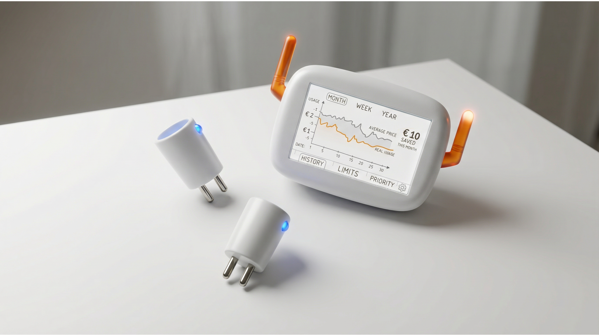
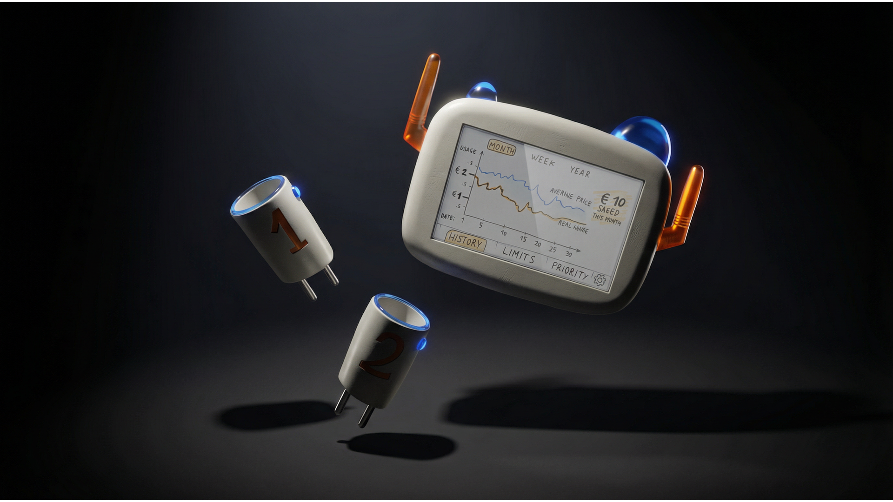

  

 

AEOM, de slimme interface die gezinnen helpt zonne-energie optimaal te gebruiken en hun enrgieverbruik beter te begrijpen.

🛠️ Built by ``Miro Mangelschots`` & ``Kylian Maelstaf`` & ``Rune Coppieters``  
🔥 Supervised by ``prof. dr. Bas Baccarne``, ``Yannick Christiaens`` & ``Wouter Devriese``    
🌱 Grown at ``Ghent University`` 🏛️ ``Industrial Design Engineering`` ([project overview](https://github.com/basbaccarne/human-centered-design)) 

19/01/2026   

## Samenvatting

Zonnepaneel-houders kunnen de goedkopere energie niet optimaal gebruiken, omdat ze overdag werken. Bestaande oplossingen zijn grote investeringen.

Dit probleem werd onderzocht aan de hand van literatuuronderzoek, interviews met de gebruikers en gebruikerstests.

De oplossing is een slim systeem dat apparaten aan en uit schakelt, op basis van de geproduceerde zonne-energie. Daarbij houd het rekening met ingestelde prioriteiten en limieten.

Het systeem regelt meerdere apparaten automatisch, waardoor de opgewekte zonne-energie optimaal kan verbruikt worden. En dat zonder de gebuiker, die zich er mee bezig moet houden.

>:bulb:Voor simpele apparaten, worden slimme pluggen geintegreerd. Hiervoor worden bv. de bestaande pluggen van [Shelly](https://www.shelly.com/products/shelly-plug-s-gen3?srsltid=AfmBOoo-lc1h_WlMoQxsQ6e4mYHvGy64R30-YDIbfpTCyi_n0wwjkiSI) gebruikt.

>:zap:Voor complexere apparaten, zoals wasmachines, wordt een nieuw onderdeel ontwikkelt. De bedoeling van dat onderdeel is om draaiknoppen en touchscreens te kunnen bedienen.

  

  

## Introductie

Mensen met zonnepanelen hebben overdag, als de zon schijnt, goedkope energie. Ze kunnen daar echter vaak geen gebruik van maken, doordat ze overdag naar hun werk zijn. Ook hebben de meeste mensen geen batterij of een te kleine batterij. Deze systemen zijn trouwens een hele investering, waardoor men  dus niet zomaar beslist om even een batterij te kopen. Bovendien hebben zonnepaneel-eigenaars helemaal geen zin, om zich bezig te houden met het beste moment om hun energie te gebruiken.
Bovendien zijn de digitale energiemeters minder voordelig voor mensen met zonnepanelen, in vergelijking met de terugkerende teller.[^1]

Het doel van dit project is om een product te ontwikkelen dat mensen met zonnepanelen helpt om te besparen. Daarbij is het ook belangrijk om de gebruiker zo duidelijk mogelijke inzichten te bezorgen, over hun energieverbruik. De focus ligt bij het moeiteloos integreren van dit product, in het dagelijkse leven van de gebruikers.

## Inhoudstafel

1. [Methodologie](./docs/methodologie.md)
2. [Discovery](./docs/discovery.md)
3. [Defintion](./docs/definition.md)
4. [Design Requirements](./docs/design_requirements.md)
5. [Bill of materials](./docs/bom.md)

## Kritische reflectie

Bij de define fase bleek het een uitdaging te zijn, om ons op het juiste pad te houden en niet de mist in te wandelen. We vergaten soms dat de in de define fase zaten, waar het de bedoeling is om oplossingen voor het probleem te zoeken.

We hebben eerst onderzoek gedaan naar de meest intuitieve layout van een scherm-interface. Dit onderzoek had bij nader inzien beter gepast bij de develop fase.
In het komende semester zal het dus belangrijk zijn voor ons om elke les even stil te staan en de vraag te stellen, of wat we mee bezig zijn nog past binnen deze fase...

Bovendien hebben we veel tijd verloren, door in de les te bespreken wat de volgende stappen zijn, waardoor we meerdere, hele lessen weinig hebben gedaan, buiten overlegd. 
Op een bepaald moment twijfelden we over de richting waarin we gingen, we stonden op het punt om een pivot te ondergaan, maar hebben dat uiteindelijk niet gedaan. De oorzaak van deze twijfel was waarschijnlijk dat we juist het interface-onderzoek hadden uitgevoert, dat eigenlijk voor het volgende semester was bedoeld. Door deze pseudo-pivot zijn opniew veel tijd verloren.
Hierdoor hadden we het gevoel dat we heel de tijd achter zaten (wat ook wel zo was) en hebben we ook geen tijd meer gehad om een een tweede onderzoek te doen dat wel goed in de define fase hoort... 

voor het komende semester zou het waarschijnlijk efficienter zijn, om ieder voor zich al eens na te denken wat de volgende stappen zijn en de anderen daarvan al op de hoogte te brengen. Zo heeft iedereen zijn eigen idee al gevormd en eens nagedacht over de puntjes van de anderen. Zo kan dit nog even besproken worden in het begin van de les, waarna nog tijd is om aan het project te werken.

## Noot inzake het gebruik van AI
Om schetsen om te zetten in renders werd "[Vizcom](https://vizcom.com)" gebruikt (o.a. [Hero-shot](img/Hero1.png)).
AI werd ook gebruikt om sommige onderzoeken te verwerken. Hierbij werd opgelet dat **alle info geanonimiseerd** werd **alvorens** AI in te zetten.

## Bijlagen
### Discovery
* Literatuuronderzoek (N=10)
  * [Benchmark protocol](/AEOM/reports%20and%20protocols/S@H_Benchmark%20protocol.pdf)
  * [Benchmark repport](/AEOM/reports%20and%20protocols/S@H_Benchmark%20report.pdf)
* Interviews (N=3)
  * [User interview protocol](/AEOM/reports%20and%20protocols/S@H_User%20Interview%20Protocol.pdf)
  * [User interview repport](/AEOM/reports%20and%20protocols/S@H_User%20interview%20report.pdf)
    
### Definition
* User testing wave 1 (N=3)
  * [Interface protocol](/AEOM/reports%20and%20protocols/Interface%20protocol.pdf)
  * [Interface repport](/AEOM/reports%20and%20protocols/Inteface%20report.pdf)
* User testing wave 2 (N=3)
  * [Functies protocol](/AEOM/reports%20and%20protocols/Functies%20protocol.pdf)
  * [Functies repport](/AEOM/reports%20and%20protocols/Functies%20report.pdf)

## Licentie

This repository contains both software and design materials created as part of an industrial design energineering project at Ghent University.

- **Software and code:** [MIT License](./LICENSE-MIT)  
- **Design, documentation, CAD, and media:** [CC BY 4.0 License](./LICENSE)
  
You are free to reuse and build upon this work, both commercially and non-commercially, as long as proper attribution is given to the original authors.

## Bronnen

[^1]: Retroactieve investeringspremie voor eigenaars van zonnepanelen na afschaffing van terugdraaiende teller. (z.d.). Vlaanderen.be. https://www.vlaanderen.be/retroactieve-investeringspremie-voor-eigenaars-van-zonnepanelen-na-afschaffing-van-terugdraaiende-teller
