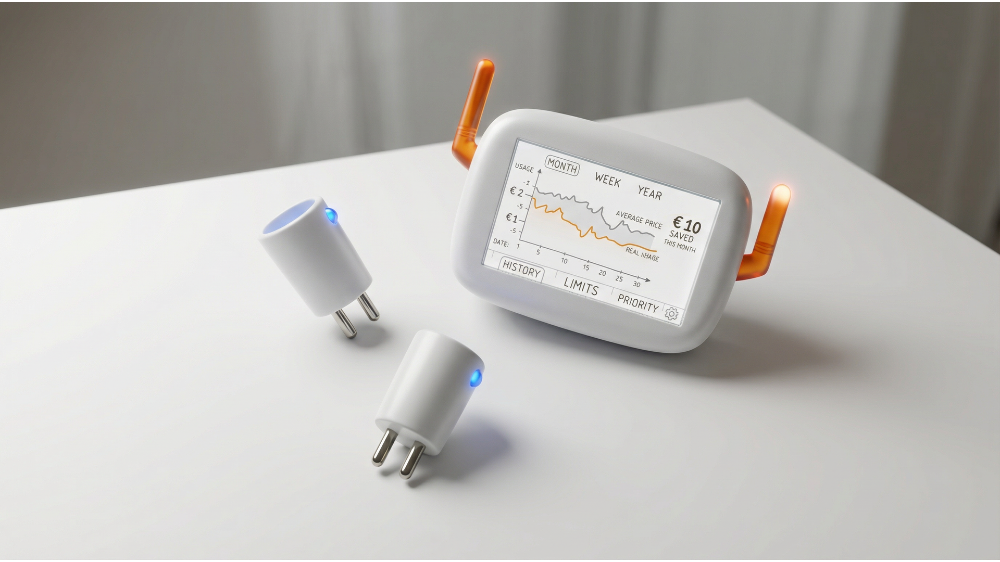
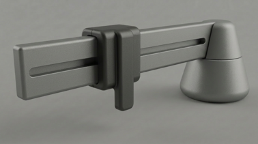

  

 

AEOM, de slimme interface die gezinnen helpt zonne-energie optimaal te gebruiken en hun enrgieverbruik beter te begrijpen.

🛠️ Built by ``Miro Mangelschots`` & ``Kylian Maelstaf`` & ``Rune Coppieters``  
🔥 Supervised by ``prof. dr. Bas Baccarne``, ``Yannick Christiaens`` & ``Wouter Devriese``    
🌱 Grown at ``Ghent University`` 🏛️ ``Industrial Design Engineering`` ([project overview](https://github.com/basbaccarne/human-centered-design)) 

19/01/2026   

## Samenvatting

Gebruikers hebben soms nood aan functionaliteiten die hun huishoudtoestellen niet hebben. Hoewel er steeds meer slimme apparaten op de markt komen, zijn deze vaak duur en is het vervangen van een perfect werkend toestel voor veel mensen niet de moeite waard.

Om dit probleem op te lossen werd **AEOM** ontwikkeld.

Dit project begon oorspronkelijk als een oplossing voor eigenaars van zonnepanelen die hun opgewekte energie optimaal wilden benutten. Tijdens het ontwerpproces bleek echter dat de onderliggende behoefte breder was: gebruikers willen bestaande apparaten automatiseren zonder deze te vervangen. Daarom verschoof de focus naar het slim maken van zogenaamde **"domme" apparaten**, met een specifieke focus op wasmachines en droogkasten.

### Voorbeelden van toepassingen

- Een wasmachine automatisch starten wanneer de energieprijs het laagst is.
- Een droogkast laten draaien wanneer er voldoende zonne-energie beschikbaar is.
- Een wasprogramma starten zodat het klaar is wanneer de gebruiker thuiskomt.
- Bestaande toestellen integreren in een slimme woning zonder nieuwe apparaten aan te kopen.

### De oplossing

AEOM is een modulair systeem dat fysieke knoppen en draaiknoppen van bestaande apparaten automatisch kan bedienen. Hierdoor kunnen huishoudtoestellen geautomatiseerd worden zonder aanpassingen aan het toestel zelf.

✨ Automatiseert bestaande apparaten zonder demontage.

⚙️ Bedient fysieke knoppen en draaiknoppen automatisch.

📱 Configureerbaar via een gebruiksvriendelijke applicatie.

🔔 Ondersteunt meldingen en statusupdates.

🔄 Herbruikbaar op verschillende toestellen.

Door bestaande apparaten slimmer te maken in plaats van ze te vervangen, biedt Orion een toegankelijke en duurzame manier om meer comfort, automatisering en controle in huis te brengen.
<!--Gebruikers hebben soms nood aan functionaliteit, die hun apparaten niet hebben. Nieuwe "slimme" apparaten bestaan, maar zijn vaak duur. Het is dan ook voor veel mensen niet de moeite om daarvoor een nieuwe machine te kopen. Om dat probleem op te lossen werd *AEOM* ontwikkeld.

Dit project is begonnen als oplossing voor zonnepaneel-houders, die optimaal gebruik willen maken van hun zonne-energie. 
Uiteindelijk is dat echter verandert, naar het automatiseren van "domme" apparaten. Met een focus op wasmachines en droogkasten.

>Voorbeeld van een toepassing:
>De was starten op het meest economische moment van de dag. Of op het juiste moment, zodat die klaar is wanneer de gebruiker thuis komt... 

De oplossing is een slim systeem dat apparaten aan en uit schakelt op basis van parameters, die de gebruiker instelt.

<!--Zonnepaneel-houders kunnen de goedkopere energie niet optimaal gebruiken, omdat ze overdag werken. Bestaande oplossingen zijn grote investeringen.

Dit probleem werd onderzocht aan de hand van literatuuronderzoek, interviews met de gebruikers en gebruikerstests.

De oplossing is een slim systeem dat apparaten aan en uit schakelt, op basis van de geproduceerde zonne-energie. Daarbij houd het rekening met ingestelde prioriteiten en limieten.

Het systeem regelt meerdere apparaten automatisch, waardoor de opgewekte zonne-energie optimaal kan verbruikt worden. En dat zonder de gebuiker, die zich er mee bezig moet houden.

>:bulb:Voor simpele apparaten, worden slimme pluggen geintegreerd. Hiervoor worden bv. de bestaande pluggen van [Shelly](https://www.shelly.com/products/shelly-plug-s-gen3?srsltid=AfmBOoo-lc1h_WlMoQxsQ6e4mYHvGy64R30-YDIbfpTCyi_n0wwjkiSI) gebruikt.

>:zap:Voor complexere apparaten, zoals wasmachines, wordt een nieuw onderdeel ontwikkelt. De bedoeling van dat onderdeel is om draaiknoppen en touchscreens te kunnen bedienen.

  

-->

  

## Introductie

De opkomst van hernieuwbare energie, zoals zonnepanelen, zorgt voor nieuwe uitdagingen in huishoudelijk energiegebruik. Hoewel energie lokaal wordt geproduceerd, slagen gebruikers er vaak niet in om hun verbruik af te stemmen op deze productie, wat leidt tot inefficiëntie en verlies van potentieel voordeel.

Bestaande oplossingen, zoals slimme toestellen, vereisen doorgaans een aanzienlijke investering en vervangen bestaande apparaten. Dit maakt ze voor veel gebruikers minder toegankelijk.

AEOM vertrekt vanuit een alternatieve benadering: het slim maken van bestaande, “domme” toestellen via een externe interface. Door apparaten automatisch aan te sturen op basis van parameters zoals energieproductie, kost en gebruikscontext, maakt AEOM efficiënter en bewuster energiegebruik mogelijk zonder ingrijpende veranderingen in de bestaande huishoudcontext.

Dit dossier beschrijft hoe dit concept tot stand kwam, met nadruk op de onderbouwing van ontwerpkeuzes via gebruikersonderzoek, iteratie en technische validatie.

## Inhoudstafel

1. [Methodologie](./docs/Methodologie.md)
2. [Discovery](./docs/1_Discovery.md)
3. [Defintion](./docs/2_Definition.md)
4. [The pivot](./docs/3.1_The_Pivot.md)
5. [Develop 1](./docs/3_Develop_1.md)
6. [Develop 2](./docs/4_Develop_2.md)
7. [Develop 3](./docs/5_Develop_3.md)
8. [Design Requirements](./docs/Design_requirements.md)
9. [Bill of materials](./docs/BOM.md)
10. [Handleiding voor laatste prototype](./docs/Manual.md)

# Conclusie

Tijdens dit project werd onderzocht hoe bestaande huishoudtoestellen slimmer gemaakt kunnen worden zonder deze te vervangen. Uit gebruikersinterviews, benchmarkonderzoek, technische experimenten en meerdere iteraties van prototyping bleek dat veel gebruikers nood hebben aan extra functionaliteiten, zoals automatisering en slim energiebeheer, maar niet bereid zijn om hiervoor nieuwe toestellen aan te kopen.

Het finale concept, **AEOM**, is een universeel automatiseringsplatform dat fysieke knoppen en draaiknoppen van bestaande apparaten automatisch kan bedienen. Hierdoor kunnen toestellen zoals wasmachines en droogkasten geïntegreerd worden in slimme automatiseringsscenario's zonder enige aanpassing aan het toestel zelf.

Het concept bestaat uit een positioneerbare arm die zich naar de gewenste knop beweegt en deze fysiek bedient. Via een mobiele applicatie kan de gebruiker toestellen configureren, automatiseringen instellen en meldingen ontvangen. Hierdoor wordt functionaliteit toegevoegd aan bestaande apparaten, terwijl hun oorspronkelijke werking volledig behouden blijft.

Wij geloven dat **AEOM** de best mogelijke oplossing is voor het gestelde probleem omdat het verschillende voordelen combineert die tijdens het onderzoek consequent als belangrijk naar voren kwamen:

- Geen vervanging van bestaande toestellen nodig.
- Compatibel met een brede waaier aan huishoudtoestellen.
- Eenvoudig te installeren zonder demontage of technische kennis.
- Herbruikbaar op verschillende apparaten.
- Lagere kost dan de aankoop van nieuwe slimme toestellen.
- Behoud van volledige controle door de gebruiker.
- Mogelijkheid om toekomstige functionaliteiten via software uit te breiden.

Bovendien werden gedurende het ontwikkelproces verschillende alternatieve oplossingen onderzocht, waaronder slimme stekkers, vaste interfaces, meerdere actuatorconfiguraties, verschillende bevestigingsmethoden en uiteenlopende positioneringsmechanismen. De uiteindelijke combinatie van een **sliding & rotating arm**, een **servogestuurde knopbediening** en een **modulaire mobiele interface** behaalde consequent de beste resultaten op vlak van gebruiksgemak, betrouwbaarheid, universaliteit en gebruikersacceptatie.

De ontwerpkeuzes zijn gebaseerd op de verzamelde onderzoeksresultaten en voldoen aan de vooropgestelde [Design Requirements](./Design_Requirements.md). Hierdoor vormt **AEOM** een technisch haalbare, gebruiksvriendelijke en toekomstgerichte oplossing voor het automatiseren van bestaande huishoudtoestellen.

  

## Kritische reflectie

Bij de define fase bleek het een uitdaging te zijn, om ons op het juiste pad te houden en niet de mist in te wandelen. We vergaten soms dat de in de define fase zaten, waar het de bedoeling is om oplossingen voor het probleem te zoeken.

We hebben eerst onderzoek gedaan naar de meest intuitieve layout van een scherm-interface. Dit onderzoek had bij nader inzien beter gepast bij de develop fase.
In het komende semester zal het dus belangrijk zijn voor ons om elke les even stil te staan en de vraag te stellen, of wat we mee bezig zijn nog past binnen deze fase...

Bovendien hebben we veel tijd verloren, door in de les te bespreken wat de volgende stappen zijn, waardoor we meerdere, hele lessen weinig hebben gedaan, buiten overlegd. 
Op een bepaald moment twijfelden we over de richting waarin we gingen, we stonden op het punt om een pivot te ondergaan, maar hebben dat uiteindelijk niet gedaan. De oorzaak van deze twijfel was waarschijnlijk dat we juist het interface-onderzoek hadden uitgevoert, dat eigenlijk voor het volgende semester was bedoeld. Door deze pseudo-pivot zijn opniew veel tijd verloren.
Hierdoor hadden we het gevoel dat we heel de tijd achter zaten (wat ook wel zo was) en hebben we ook geen tijd meer gehad om een een tweede onderzoek te doen dat wel goed in de define fase hoort... 

voor het komende semester zou het waarschijnlijk efficienter zijn, om ieder voor zich al eens na te denken wat de volgende stappen zijn en de anderen daarvan al op de hoogte te brengen. Zo heeft iedereen zijn eigen idee al gevormd en eens nagedacht over de puntjes van de anderen. Zo kan dit nog even besproken worden in het begin van de les, waarna nog tijd is om aan het project te werken.

## Noot inzake het gebruik van AI
Om schetsen om te zetten in renders werd "[Vizcom](https://vizcom.com)" gebruikt (o.a. [Hero-shot](img/Hero1.png)).
AI werd ook gebruikt om sommige onderzoeken te verwerken. Hierbij werd opgelet dat **alle info geanonimiseerd** werd **alvorens** AI in te zetten.

## Bijlagen

### Discovery
* Literatuuronderzoek (N=10)
  * [Benchmark protocol](reports%20and%20protocols/S@H_Benchmark%20protocol.pdf)
  * [Benchmark report](reports%20and%20protocols/S@H_Benchmark%20report.pdf)
* Interviews (N=3)
  * [User interview protocol](reports%20and%20protocols/S@H_User%20Interview%20Protocol.pdf)
  * [User interview report](reports%20and%20protocols/S@H_User%20interview%20report.pdf)
    
### Definition
* User testing wave 1 (N=3)
  * [Interface protocol](reports%20and%20protocols/Interface%20protocol.pdf)
  * [Interface repport](reorts%20and%20protocols/Inteface%20report.pdf)
* User testing wave 2 (N=3)
  * [Functies protocol](reports%20and%20protocols/Functies%20protocol.pdf)
  * [Functies repport](reports%20and%20protocols/Functies%20report.pdf)

### Develop 1
* User interview (N=3)
  * [Interview after pivot protocol](reports%20and%20protocols/Interface%20protocol.pdf)
  * [Interview after pivot repport](reports%20and%20protocols/Inteface%20report.pdf)
* Prototype testing (N=~5)
  * [Drukken van knoppen protocol](reports%20and%20protocols/Functies%20protocol.pdf)
  * [Drukken van knoppen report](reports%20and%20protocols/Functies%20report.pdf)

### Develop 2
* Draaien van knoppen (N=3)
  * [Draaien van knoppen protocol](reports%20and%20protocols/2.%20Draaien%20van%20knoppen%20protocol.pdf)
  * [Draaien van knoppen report](reports%20and%20protocols/2.%20Draaien%20van%20knoppen%20report.pdf)
* Machine interface (N=10)
  * [Machine interface protocol](reports%20and%20protocols//4.%20Machine%20interface%20protocol.pdf)
  * [Machine interface report](reports%20and%20protocols//4.%20Machine%20interface%20report.pdf)
* Gebruikersonderzoek (N=5)
  * [Gebruikersonderzoek protocol](reports%20and%20protocols/5.%20Gebruikersonderzoek%20protocol.pdf)
  * [Gebruikersonderzoek report](reports%20and%20protocols/5.%20Gebruikersonderzoek%20report.pdf)
* Bevestigingsmechanismen (N=3)
  * [Bevestigingsmechanismen protocol](reports%20and%20protocols/2.%20Bevestigingsmechanismen%20protocol.pdf)
  * [Bevestigingsmechanismen report](reports%20and%20protocols/2.%20Bevestigingsmechanismen%20report.pdf)
    
### Develop 3
* CMF (N=5)
  * [CMF protocol](reports%20and%20protocols/6.CMF_protocol.pdf)
  * [CMFn report](reports%20and%20protocols/6.CMF_report.pdf)

## Licentie

This repository contains both software and design materials created as part of an industrial design energineering project at Ghent University.

- **Software and code:** [MIT License](./LICENSE-MIT)  
- **Design, documentation, CAD, and media:** [CC BY 4.0 License](./LICENSE)
  
You are free to reuse and build upon this work, both commercially and non-commercially, as long as proper attribution is given to the original authors.

## Bronnen

<!---[^1] Retroactieve investeringspremie voor eigenaars van zonnepanelen na afschaffing van terugdraaiende teller. (z.d.). Vlaanderen.be. https://www.vlaanderen.be/retroactieve-investeringspremie-voor-eigenaars-van-zonnepanelen-na-afschaffing-van-terugdraaiende-teller-->

 

---

  <a href="/README.md">⬆️ Return to top</a> 
  <a href="/LICENSE">📜 CC License</a> & <a href="/LICENSE">MIT License</a> 

