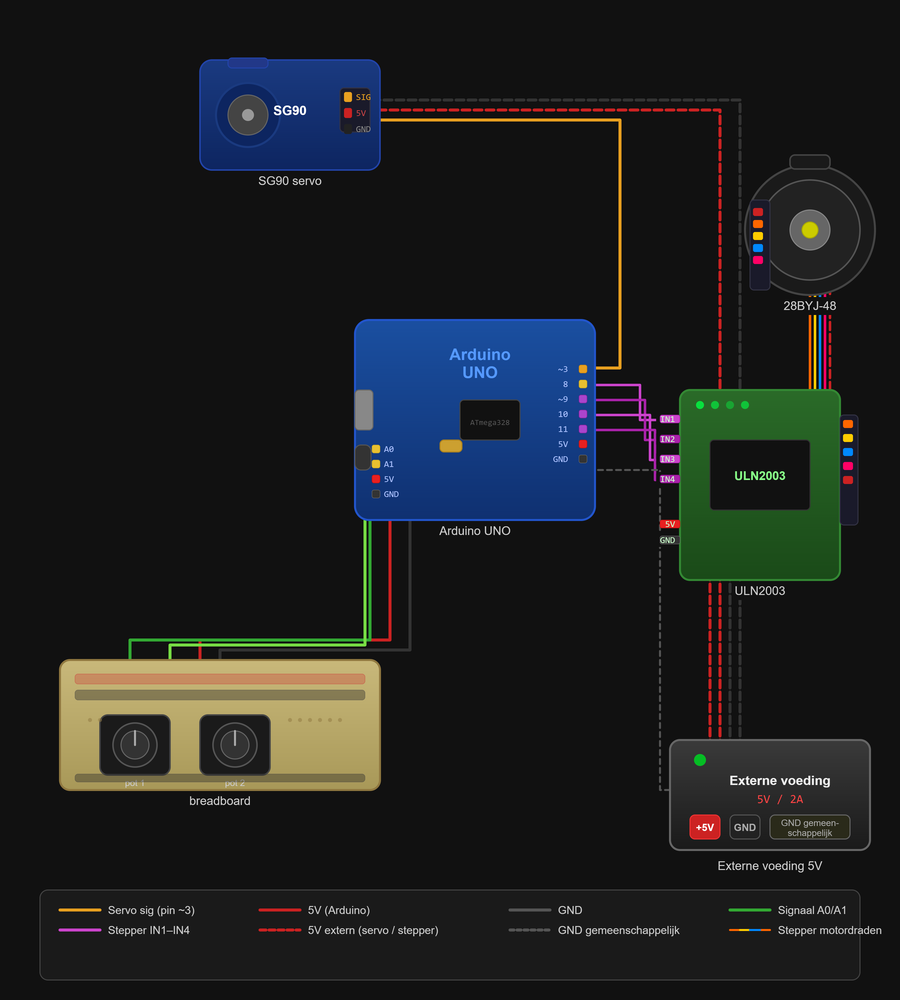
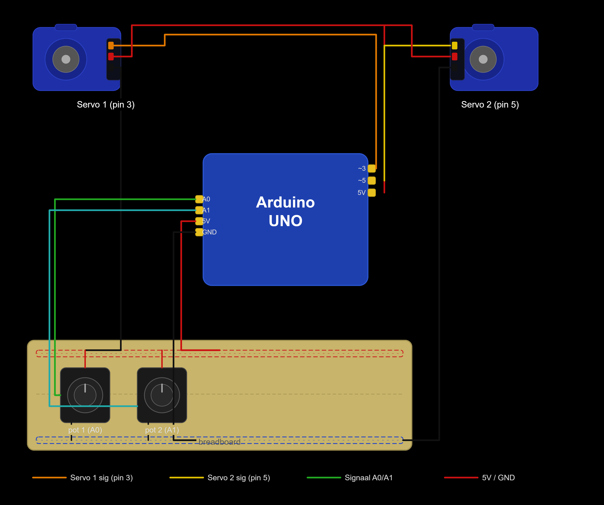

## Code structuur

Deze map bevat de Arduino implementaties voor de aansturing van de verschillende mechanische concepten.  

### **Servo_and_Stepper_code**  
  Code voor de **sliding + rotating arm**  
  - Combineert een **servo motor** (rotatie) met een **stepper motor** (lineaire beweging)  
  - Zorgt voor positionering van de arm in zowel hoek als afstand  
  - Wordt gebruikt voor de finale geselecteerde oplossing  

  
  
### **Servos_code**  
  Code voor de **double pivot arm**  
  - Gebruikt meerdere **servo motoren** voor de verschillende rotatiepunten  
  - Stuurt de arm aan via gecombineerde hoeken (inverse kinematics)  
  - Wordt gebruikt voor het alternatieve concept dat later geëlimineerd werd
    

  
