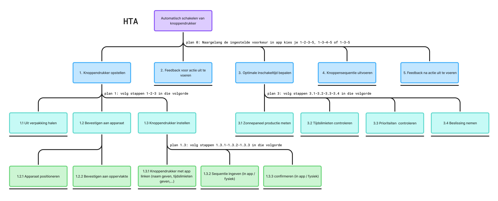
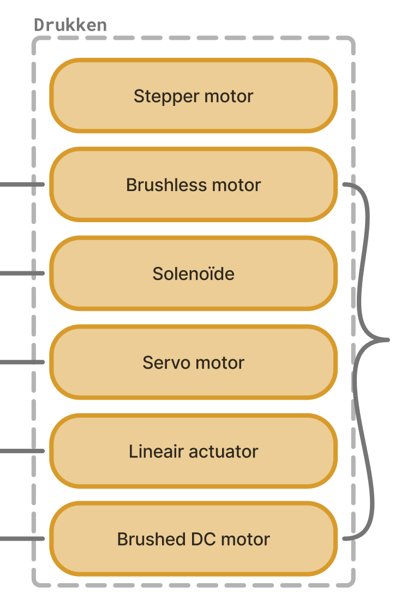

## Develop 1

### Doelstellingen
Aangezien er net [een pivot](3.1_The_pivot.md) achter de rug is, was in de eerste plaats belangrijk om inzichten te verkrijgen in onze nieuwe doelgroep. 

Ten tweede moest er onderzocht worden welk actuator of motor het best zou werken voor het indrukken van de bedieningsknoppen van een wasmachine of droogkast.

### Methoden

#### 1. Schematische ontleding + ideation

Om het vervolg van het ontwerpproces te ondersteunen werden enkele schemas opgesteld. Deze bieden steun doorheen de komende fasen van het ontwerpen.

Eerst werd er een Hierarchical Task Analysis (HTA) opgesteld:

  

Vervolgens werd het product opgesplitst in zijn verschillende functies, aan de hand van een functienalayse:

  

Voor elk van die functies, afzonderlijk, werden oplossingen bedacht.

De HTA en gegenereerde ideeën werden samengegoten in één gedetailleerd schema, waarin human-product interacties, functies, mogelijke deeloplossingen en de interactie tussen die componenenten worden weergegeven.

  

> [!TIP]
> Om bovenstaande afbeelding in detail te bekijken:
> 1. Linksklik op de afbeelding
> 2. Rechtsklik op de afbeelding
> 3. Klik op "Open image in new tab"

 

#### 2. User interview (N=3)

Om meer inzichten te verkrijgen in de wensen en/of eisen van de gebruikers, werden opnieuw user interviews afgelegd. Daarbij worden vragen gesteld aan de gebruiker, die gericht zijn op het beantwoorden van onzekerheden in deze fase:
- Zien de gebruikers een meerwaarde in het product, welke?
- Is er interesse in het product?
- Meerwaarde tegenover enkel slimme stekkers kopen?
- Wat maakt dit meer dan enkel een coole gadget?
- Hoeveel setuptijd is acceptabel?
- Hoe vaak zouden mensen iets willen automatiseren?
- Wat willen mensen automatiseren?
- Verkopen als bouwpakket?
- Pains identificeren waarop ingespeeld kan worden?

Voor meer detail over dit onderzoek zie <a href="../reports and protocols/Protocol interview after pivot.pdf">Protocol interview after pivot</a>.

 

#### 3. Fysieke tests aan de hand van prototypes

   Om te onderzoeken welke electronische componenten het best zouden werken voor deze toepassing, werd eerste een eerste eliminatie uitgevoerd, op basis van voorkennis. Vervolgens werden voor de overblijvende actuatoren, prototypes gebouwd. Deze prototypes werden op een wasmachine aangebracht en geactiveerd. Op die mannier werd getest of de prototypes in staat waren om de knoppen van de wasmachine in te drukken. Voor meer detail of een blik op de gebruikte prototypes, zie <a href="../reports and protocols/1. Drukken van knoppen protocol.pdf">Drukken van knoppen protocol</a>.

 
 

### Resultaten
De resultaten van beide onderzoeken worden kort besproken.

#### 1. User interview (N=3)
Uit deze user interviews is gebleken dat de grootste redenen voor automatisatie, energiebesparing en comfort zijn. Energiebesparing gaat onderliggend echter om geldbesparing.

De meeste gebruikers zouden dit product gebruiken, voor het slim maken van domme apparaten. 
De meerwaarde zit daarbij wel in het selecteren van specifieke programma’s.
Ook is gebleken dat men het een nadeel zou vinden, als er geen verbruik uitgelezen kan worden...

De volgende zaken zijn bij alle gebruikers naar boven gekomen:
- De koopprijs mag wel een redelijke investering zijn, zolang er voldoende meerwaarde in zit, het geld moet terugverdient kunnen worden.
- De keuze voor meldingen te krijgen of niet is ook gevraagd, aangezien dat zeer subjectief is per persoon.
- Herbruikbaarheid, gebruiksvriendelijkheid en eventueel ook compatibiliteit met andere systemen
- Alarmmeldingen
- Betrouwbaarheid, bedrijfszekerheid
- Lage setuptijd, eenmalig uit te voeren waarna het toestel grotendeels zelfstandig dient te werken.
- Makkelijk te integreren bij apparaten
- Geen bouwpakket

 

#### 2. Fysieke tests

Dit is de resulterende tabel, waarin de subjectieve beoordeling van de verschillende componenten in staat:

|  | Kan knop indrukken? | Kracht |	Feedbackloop | Gewicht | Gemak aansturen (extra componenten + code) |
|----|----|----|----|----|----|
|**Servo**	|Ja	|Matig	|Ja => hoge precisie + herhaalbaarheid	|Matig	|Matig|
|**Stepper (niet op knop getest)**	|? (Waarschijnlijk)	|Matig	|Nee (Maar hoge precisie + herhaalbaarheid, bij geen slip)	|Zwaar	|Moeilijk|
|**Solenoide**	|Nee	|Laag	|Nee (niet per se nodig) |Zwaar	|Makkelijk|
|**Lineaire actuator**	|Ja	|Zeer Hoog	|Nee	|Matig	|Makkelijk|
|**Brushed + geared**	|Ja	|Zeer Hoog	|Nee	Zwaar	|Makkelijk|

 

### Conclusies & implicaties
Hier worden de conclusies en implicaties voor het product, kort besproken.
Voor een meer gedetailleerde bespreking van de resultaten zie <a href="../reports and protocols/1. Drukken van knoppen report.pdf">Drukken van knoppen report</a> en <a href="../reports and protocols/Report interview after pivot.pdf">Report interview after pivot</a>.

#### Product requirements
- De knoppencontroller kan specifieke programma’s uitvoeren
- De knoppencontroller is betrouwbaar
- De knoppencontroller is herbruikbaar
- De knoppencontroller is makkelijk te integreren, zonder demontage
- De knoppencontroller kan ingesteld worden in minder dan vijf minuten
- De knoppencontroller kan zijn waarde terugverdienen binnen de 3 jaar
- De knoppencontroller kan zelfstandig werken
- De app geeft alarmmeldingen
- De app heeft de mogelijkheid om meldingen in/uit te schakelen

#### Key insights
- Er is interesse in het product:
De gebruikers zijn geïntresseerd in een product dat apparaten slim maakt, zodat er op die manier meer comfort is en geld bespaard word.
 
- De slimme stekkers (al bestaand) zijn nog steeds een nuttige toevoeging aan ons product. Aangezien gebruikers nog steeds wensen het energieverbruik af te lezen.
 
- De brushed DC motor gecombineerd met een schroefmechanisme (= lineaire actuator), is de best passende oplossing voor het indrukken van knoppen op een wasmachine.
