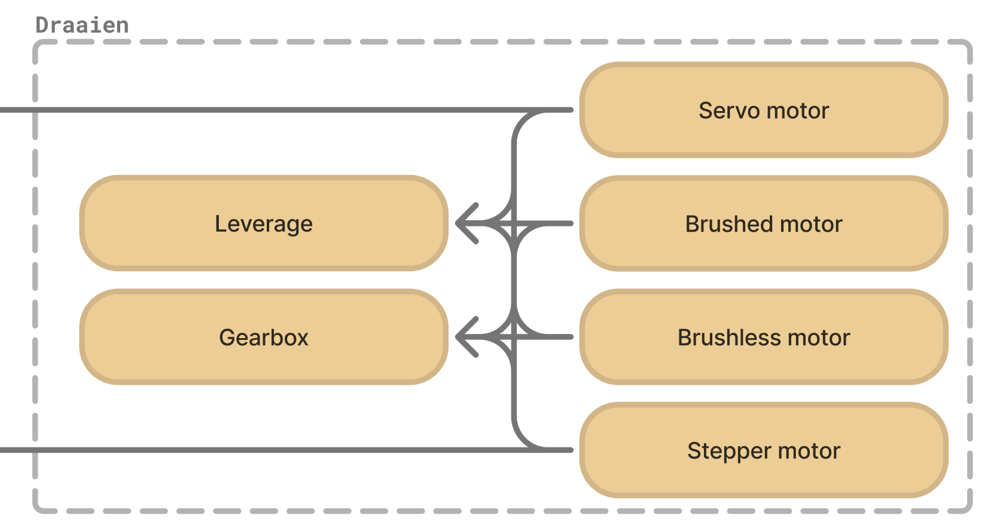
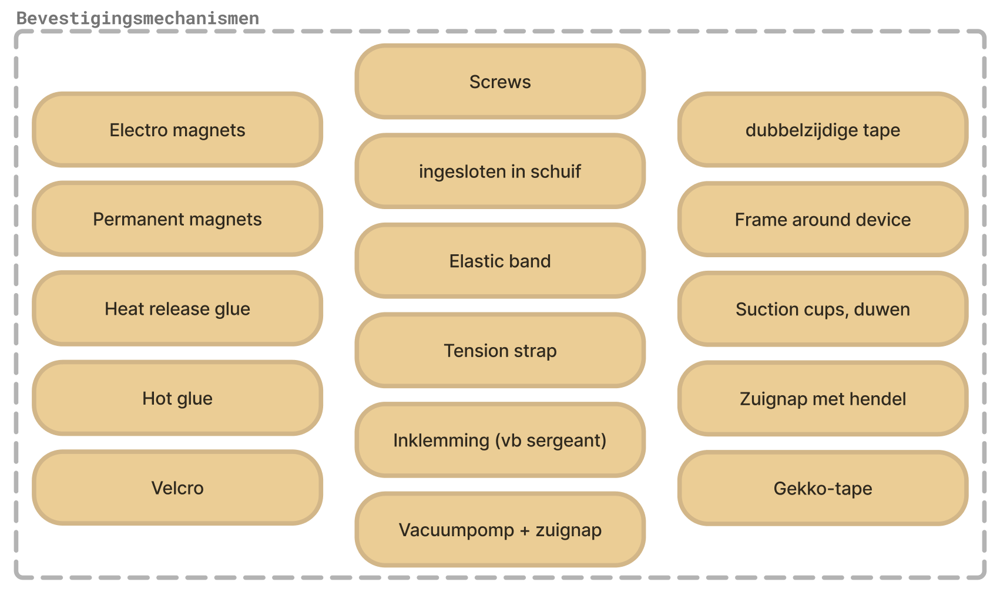

## Develop 2

### Doelstellingen
In de vorige de develop 1 fase werd een schema met human-product-interactie's opgesteld. Daar werd ook voor elke subfunctie oplossingen bedacht.

In deze fase moet verder onderzoek en tests gedaan worden om de beste deeloplossingen te selecteren.

Er wordt ingegaan op volgende deelfuncties:
- Draaien van knoppen
- Machine interface =  instellen van de interactie-locatie
- Bevestigingsmechanismen

### Methoden
#### 1. Draaien van knoppen
Bij het besturen van een draaiknop komen er twee hoofdzaken naar boven:
•	Welke actuator zullen we gebruiken?
•	Hoe gaan we de draaiknop manipuleren?
 

##### Actuator

  

1.	Ideeën generatie actuatoren
2.	De resultaten van vorig onderzoek, die nuttig zijn, worden gebruikt om actuatoren te elimineren
3.	Kracht servo apart uittesten op de knop*
4.	Er wordt één finale actuator gekozen

> [!NOTE]
>*Een servo is eigenlijk opgebouwd uit een geborstelde DC motor en tandwielkast met toevoeging van één of andere sensor.
>Omdat die feedback van een sensor in deze toepassing belangrijk is, zou het makkelijker zijn, om de servo te gebruiken. Daarvoor moet de servo echter sterk genoeg zijn om de knop te kunnen draaien. Voor die reden wordt de servo nog eens apart uitgetest op de knop.

 

##### Manipulatie draaiknop

   1.	Ideeën generatie om de knop te kunnen manipuleren 
  2.	Er worden prototypes gemaakt voor de verschillende ideeën 
  3.	De prototypes worden uitgetest op de draaiknop van een wasmachine (beiden worden aangestuurd met hetzelfde handvat) 
  4.	De voordelen en nadelen van elk idee worden opgesomd 
  5.	De ideeën worden vergeleken en er wordt één idee uitgekozen 
   
  Voor meer detail over dit onderzoek of een blik op de gebruikte prototypes, zie <a href="../reports and protocols/2. Draaien van knoppen protocol.pdf">Draaien van knoppen protocol</a>.

 

#### 2. machine interface onderzoek
#TODO

#### 3. bevestigingsmechanismen

  

  
##### Deel 1: eerste intuïtieve eliminatie.

##### Deel 2: prototyping + vergelijkend testen.
1.	Modulair prototypen
2.	Op wasmachine hangen
3.	Met weegschaal aan het prototype trekken tot het los komt
4.	Filmen bij hoeveel kg kracht het bevestigingsmechanisme lost
5.	Maximale kracht opmeten voor trek en moment voor elke oplossing
6.	Per oplossing 4 tests uitvoeren: 2x trek & 2x moment
7.	Tabel opstellen en gemiddeldes van trek en moment per oplossing berekenen
8.	Grafiek opstellen

Voor meer detail over dit onderzoek of een blik op de gebruikte prototypes, zie <a href="../reports and protocols/4. Bevestigingsmechanismen protocol.pdf">Bevestigignsmechanismen protocol</a>.

 
 

### Resultaten
#### 1. Draaien van knoppen

##### a. Vergelijking actuatoren
||Kracht|Gewicht|Gemak aansturing|Feedbackloop|
|--:|:--:|:--:|:--:|:--|
|**Servo**|Matig|Matig|Matig|Ja => hoge precisie + herhaalbaarheid|
|**Stepper**|Matig|Zwaar|Moeilijk|Nee (Maar hoge precisie + herhaalbaarheid, bij geen slip)|
|**Brushed + gearbox**|Zeer hoog|Zwaar|Makkelijk|Nee|

> [!NOTE] 
>stepper niet uitgetest op machine #TODO

 

##### b. Extra servo test

><a href="../reports and protocols/4. Bevestigingsmechanismen protocol.pdf"><b>Servo_draaien knoppen.mp4</b></a> 
>De servo had niet genoeg kracht om zelfstandig te knop te draaien, maar er was niet veel extra kracht vereist. Er werd niet getest met een sterkere servo-motor, maar er kan vanuit gegaan worden dat grotere servo-motoren wel de knop zouden kunnen draaien.

 

##### c. Pros & Cons manipulatie draaiknop
###### Knijper rond draaiknop

  

✅ Er is veel grip door de instelbare klemkracht 
✅ Geen perfect ronde vorm nodig 
✅ Uitstekende vormen zijn geen probleem 
✅ Eenvoudige constructie 

❌ Er is meer kracht nodig dan de andere concepten omdat er geen overbrenging aanwezig is (as motor = as knijper, zonder overbrenging) 

 
 

###### Wieltje tegen draaiknop

  

✅ Voordelige overbrenging, die de nodige kracht van de motor verminderd: door het verschil in diameter tussen het kleine wieltje en de grotere draaknop verminderd de aandrijfkracht. 
✅ Het is een zeer compacte oplossing 
✅ Eenvoudige constructie en montage 

❌ Weinig grip, waardoor er slip aanwezig is en de draaiknop **onbetrouwbaar of niet zal roteren** 
❌ **Werkt enkel** goed **met één vorm**: een perfect ronde cirkel, zonder uitstekende delen 

 
 

###### Vertanding op draaiknop met een tandwiel

  

✅ Er is een overbrenging aanwezig wat de nodige kracht van de motor verminderd. 
✅ Het is een compacte oplossing 

❌ Kans op slip tussen tandwielring en draaiknop 
❌	Niet zo universeel: 
-→ ❌ Werkt enkel goed met één vorm: een perfect ronde cirkel 
-→ ❌ Uitstekende delen van de draaiknop zorgen voor problemen 
-→ ❌ Verschil in knopdiameter tussen toestellen zorgt voor compatibiliteitsproblemen 
 
 

#### 2. Machine interface onderzoek

##### a. Eerste eliminatie

|  | || **Peg board** | **Grid** | **Sliding + rotating arm** | **Rotating pivot arm** | **Lead screw carriage** | **Rail + slide carriage** | **Seperate units** | **Standing carriage** | **Spider arms** |
|:---:|:---:|:--:|:---:|:---:|:---:|:---:|:---:|:---:|:---:|:---:|:---:|
|**Criteria** v v v|**Gewicht** v v v ||  |  |  |  |  |  |  |  |  |
| **Breedte** | 3 || -2 | -2 | -1 | 1 | -2 | -2 | 2 | -1 | -1 |
| **Diepte** | 3 || 2 | 2 | 1 | 1 | 0 | 0 | 2 | -2 | -1 |
| **Stabiliteit** | 3 || 2 | 2 | -1 | -2 | 2 | 1 | 2 | -2 | -1 |
| **Nauwkeurigheid** | 3 || -1 | -2 | 2 | 2 | 2 | 2 | -1 | 2 | -1 |
| **Complexiteit aansturing** | 1 || 2 | 2 | 0 | -2 | 0 | 0 | 2 | 0 | 2 |
| **Setup** | 3 || 0 | 0 | 1 | 2 | -1 | 0 | 0 | -1 | -1 |
| **Complexiteit ontwerp** | 1 || 2 | 2 | -1 | -1 | 0 | 1 | 2 | -1 | -2 |
| **Universaliteit** | 3 || 1 | 1 | 2 | 2 | 1 | 1 | 1 | 0 | 1 |
| **Transparantie** | 3 || -2 | -2 | 1 | 2 | 0 | 1 | 2 | 0 | 0 |
| **Totaal** | || 4 | 1 | <mark><b>14</mark> | <mark><b>21</b></mark> | 6 | 10 | <mark><b>28</b></mark> | -13 | -12 |

>[!Tip]
>Klik op de afbeeldingen in de tabel, om ze te vergroten.

 

##### b. Tweede eliminatie
#TODO

#### 3. Bevestigingsmechanismen
##### a. Beargumenteerde intuïtieve eliminatie
|Idee	|Richt geen schade aan	|Praktisch monteren	|Praktisch voor ontwerp	|Resultaat|
|--:|:--:|:--:|:--:|:--:|
|Electro magneet	|✅	|✅	|❌	|❌
|Permanente magneet	|✅	|✅	|✅	|✅|
|Smeltlijm	|✅/❌	|✅	|✅	|❌|
|Hot glue	|✅/❌	|❌	|✅	|❌|
|Velcro	|✅	|✅	|✅	|✅|
|Gekko-tape	|✅	|✅	|✅	|✅|
|Dubbelzijdige tape	|✅	|✅	|✅	|✅|
|Frame rond wasmachine	|✅	|❌	|❌	|❌|
|Schroeven	|❌	|❌	|✅	|❌|
|Ingesloten in sleuf	|✅	|✅	|❌	|❌|
|Rekker	|✅	|❌	|✅	|❌|
|Ratchet strap	|✅	|❌	|✅	|❌|
|Inklemming (vb sergeant)	|✅	|❌	|❌	|❌|
|Zuignap + vacuumpomp	|✅	|✅	|❌	|❌|
|Zuignap	|✅	|✅	|✅	|✅|
|Zuignap met hendel	|✅	|✅	|✅	|✅|

 

##### b. Prototyping + vergelijkend testen
<!---
||Magneten	|Dubbelzijdige tape	|Gekko tape	|Zuignappen	|Hendel zuignap|
|--:|:--:|:--:|:--:|:--:|:--:|
|**Moment 1**	|0,58	|~~2,17~~ => 4,67	|3,88	|0,33	|1,53|
|**Moment 2**	|0,57	|4,64	|3,87	|0,46	|1,80|
|**Trek 1**	|4,02	|~~4,65~~ => 16,90	|15,99	|2,82	|15,67|
|**Trek 2**	|3,73	|11,11	|17,71	|3,99	|15,22|
|**Moment gem**	|0,575	|3,405	|3,875	|0,395	|1,665|
|**Trek gem**	|3,875	|7,88	|16,85	|3,405	|15,22|
-->

  

>[!Warning]
>Bij deze resultaten is het belangrijk om rekening te houden dat de hendel zuignap een kleinere diameter heeft dan andere prototypes (55mm i.p.v. 65mm). Dat zorgt voor een 1.375 keer kleinere oppervlakte dan bij de andere tests.

### Conclusies & implicaties
#### 1. Draaien van knoppen

- De knijper is de beste oplossing, om de draaiknop aan te sturen.

- Voor het draaien van een wasmachine-knop, krijgtr de servomotor de voorkeur.

 

#### 2. Machine interface onderzoek
#TODO
 

#### 3. Bevestigingsmechanismen
Als finale conclusie wordt gesteld dat de gekko- of nanotape de beste optie is voor het monteren van een knoppendrukker, op een wasmachine.

 

---

  <a href="/Develop 2">⬆️ Return to top</a> 
  <a href="">🏠 Return to main<a> 
  <a href="/LICENSE">📜 CC License</a> & <a href="/LICENSE">MIT License</a> 

