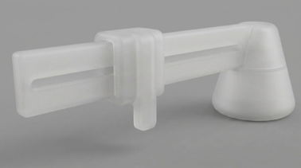
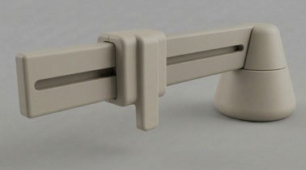
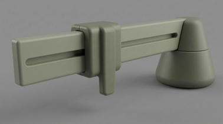
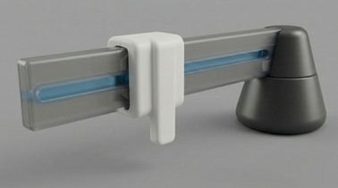
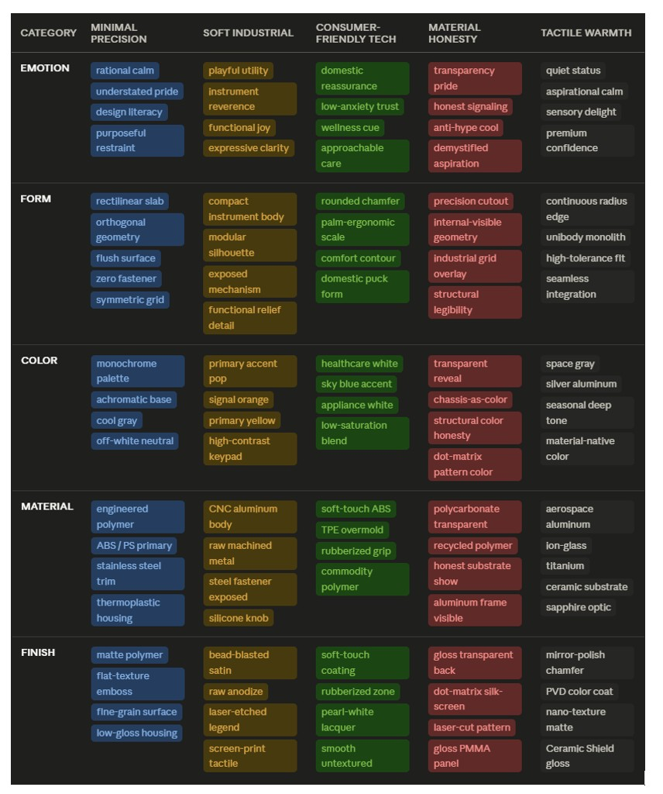

## Develop 3

### Doelstellingen  

In Develop 2 werden de functionele en technische deeloplossingen geselecteerd.  
In Develop 3 wordt de focus gelegd op de vormgeving, materialen en gebruikersbeleving van het product (CMF + UX).  

Er wordt onderzocht:  
- Hoe het product eruit moet zien  
- Welke materialen en afwerkingen het meest geschikt zijn  
- Hoe het product wordt ervaren door de gebruiker  

 

### Methoden  

#### 1. Bepalen van gewenste ervaring  

- Analyse van gewenste emoties (vertrouwen, betrouwbaarheid, duurzaamheid)  
- Benchmark van gelijkaardige bedrijven (o.a. Apple, Braun, Philips, Nothing, …)  
- Vertalen van deze inzichten naar kernwoorden voor vorm, materiaal, kleur en afwerking  

 

#### 2. CMF exploratie  

1. Kernwoorden bepalen voor:  
   - Vorm (geometrisch, symmetrisch, afgerond, monolithisch)  
   - Kleur (neutraal, monochroom, accenten voor functies)  
   - Materiaal (robuust, massief, slijtvast)  
   - Afwerking (mat, tactiel, smooth)  

2. Opstellen van een morfologische matrix met verschillende CMF varianten  

3. Genereren van varianten op basis van V3 prototype  

 

#### 3. Iteratie & visualisatie  

- Genereren van visuele varianten (Vizcom)  
- Toepassen van kleur-, materiaal- en afwerkingscombinaties  
- Uitwerken van meerdere CMF richtingen  

 

### CMF Varianten  

- Variant 1  
   Bead blasted aluminium

  

-  Variant 2  
   Matte polycarbonaat

  

- Variant 3  
  Ultra matte ABS

  

- Variant 4  
  Matte nylon

  

- Variant 5  
  Low-gloss satin PET-G met transparante accenten

  

 

#### 4. Gebruikersonderzoek  
De verschillende CMF varianten worden geëvalueerd via gebruikerstesten:  

- Vergelijking van visuele varianten  
- Beoordeling van materialen en texturen (ook blind)  
- Interviews (QAP) rond voorkeur, vertrouwen en gebruik  

Onderzoeksvragen:  
- Welke variant straalt het meeste vertrouwen uit?  
- Welke materialen lijken het meest duurzaam en onderhoudsvriendelijk?  
- Welke vormgeving past het best binnen de context van een wasmachine?  

 

### Resultaten  
#### 1.Benchmarkanalyse

  
  
- **Functie & omgeving**  
  - Het product wordt gebruikt op wasmachines en droogkasten, vaak in een vochtige omgeving  
  - Ontwerpkeuzes moeten daarom waterbestendigheid, onderhoudsgemak en betrouwbaarheid ondersteunen  
  - Eenvoudig reinigbare oppervlakken en gesloten vormen zijn cruciaal om vuilophoping te vermijden  

- **Gelijkaardige producten & bedrijven**  
  - Analyse van bedrijven zoals Apple, Braun, Philips, Nothing en Switchbot toont een duidelijke focus op minimalisme, precisie en gebruiksvriendelijkheid  
  - Deze producten combineren eenvoudige geometrieën met hoogwaardige materialen om vertrouwen en kwaliteit uit te stralen  
  - Een consistente, rustige vormtaal blijkt essentieel om technologie toegankelijk en betrouwbaar te laten aanvoelen  

- **Vorm**  
  - Geometrische en symmetrische vormen worden geassocieerd met controle en betrouwbaarheid  
  - Monolithische en gesloten volumes versterken de perceptie van waterbestendigheid en onderhoudsgemak  
  - Afgeronde randen verhogen de perceptie van veiligheid en gebruiksvriendelijkheid  
  - Proportionele en visueel evenwichtige ontwerpen versterken de perceptie van robuustheid, stabiliteit en vertrouwen  

- **Emotie**  
  - Tijdloze vormgeving wordt geassocieerd met duurzaamheid en langdurige relevantie  
  - Neutrale, discrete en sobere ontwerpen zorgen voor een rustige uitstraling en integreren beter in de omgeving  
  - Een terughoudende vormentaal versterkt het gevoel van kwaliteit en betrouwbaarheid  

- **Kleur**  
  - Neutrale en monochrome kleurpaletten zorgen voor visuele rust en integratie in de omgeving  
  - Monochromatic kleurgebruik versterkt het gevoel van coherentie en vertrouwen  
  - Subtiele accenten helpen bij het communiceren van functies zonder visuele druk  

- **Materiaal**  
  - Robuuste en massieve materialen worden gepercipieerd als duurzamer en betrouwbaarder  
  - Slijtvastheid en weerbestendigheid verhogen het vertrouwen in langdurig gebruik  

- **Afwerking**  
  - Matte en low-gloss oppervlakken verhogen de perceptie van cleanliness en laten het product duurzamer lijken  
  - Deze afwerkingen verminderen zichtbare gebruikssporen en vingerafdrukken  
  - Tactiele en gladde afwerkingen verbeteren de gebruikerservaring en onderhoudsvriendelijkheid  

 

#### 2. Gebruikersonderzoek CMF  

De verschillende CMF varianten werden geëvalueerd via interviews (N = 5), waarbij voorkeur, perceptie van kwaliteit en geschiktheid binnen de context van een wasmachine werden onderzocht.  

De resultaten tonen duidelijke trends in hoe de varianten worden ervaren:  

- **Voorkeur & perceptie**  
  - Variant 1 wordt het meest gekozen als voorkeursoptie  
  - Aluminium wordt sterk geassocieerd met kwaliteit, stevigheid en betrouwbaarheid  
  - Varianten 3 en 4 worden gewaardeerd om hun neutrale en sobere uitstraling  

- **Negatieve perceptie**  
  - Variant 5 wordt consistent negatief beoordeeld door het gebruik van meerdere kleuren en een chaotische uitstraling  
  - Variant 2 wordt gezien als goedkoop en fragiel, wat het vertrouwen in het product verlaagt  

- **Materiaalperceptie**  
  - Aluminium wordt door de meeste gebruikers gezien als het meest duurzame en kwalitatieve materiaal  
  - ABS wordt ook positief beoordeeld als alternatief materiaal  
  - Plastiek in transparante of lichte varianten wordt sneller als minder stevig ervaren  

- **Kleur & esthetiek**  
  - Neutrale kleuren worden als rustgevend en passend ervaren binnen de context van huishoudtoestellen  
  - Felle of contrasterende combinaties worden als storend en minder professioneel ervaren  
  - Monochrome grijstinten worden geassocieerd met duurzaamheid en tijdloosheid  

- **Onderhoud & duurzaamheid**  
  - Aluminium en matte afwerkingen worden als onderhoudsvriendelijk en duurzaam ervaren  
  - Vingerafdrukken en verkleuring worden als mogelijke nadelen gezien bij bepaalde plastieken  

- **Professionele uitstraling**  
  - Variant 1 scoort het hoogst op professionele uitstraling  
  - Varianten 3 en 4 volgen als neutrale en veilige keuzes  
  - Varianten 2 en 5 worden als minst professioneel ervaren  

### Conclusies & implicaties  

- Variant 1 is de beste oplossing, omwille van zijn sterke perceptie van kwaliteit, robuustheid en betrouwbaarheid bij gebruikers.  

- Aluminium wordt gezien als het meest geschikte materiaal, met ABS als valabel alternatief door zijn goede balans tussen duurzaamheid en maakbaarheid.  

### Finaal ontwerp

  

  
 Voor meer detail over dit onderzoek, zie <a href="../reports and protocols/6.CMF_protocol.pdf">CMF protocol</a>, <a href="../reports and protocols/6.CMF_report.pdf">CMF report</a>.

 

  <a href="/5_Develop_3.md">⬆️ Return to top</a> 
  <a href="/README.md">🏠 Return to main<a> 
  <a href="/LICENSE">📜 CC License</a> & <a href="/LICENSE">MIT License</a> 

