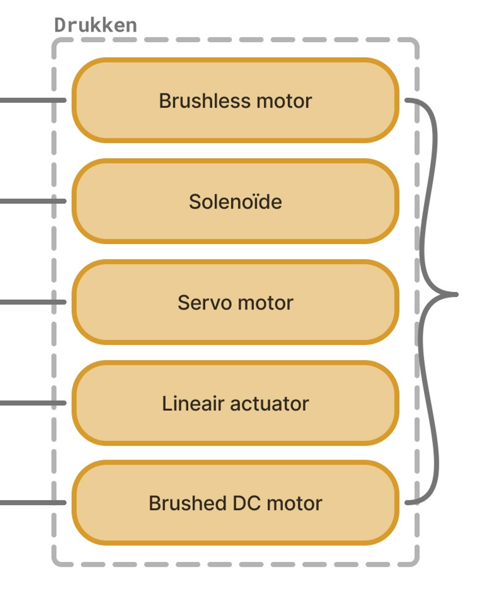

## Develop 1

### Doelstellingen
Aangezien er net [een pivot](The_Pivot.md) achter de rug is, was in de eerste plaats belangrijk om inzichten te verkrijgen in onze nieuwe doelgroep. 

Ten tweede moest er onderzocht worden, welk actuator of motor het best zou werken voor het indrukken van knoppen, van een wasmachine of droogkast.

### Methoden

#### 1. Schematische ontleding + ideation

Om het vervolg van het ontwerpproces te ondersteunen werden enkele schemas opgesteld. Deze bieden steun doorheen de komende fasen van het ontwerpen.

Eerst werde een Hierarchical Task Analysis (HTA) opgesteld:

  

Vervolgens werd het product opgesplitst in zijn verschillende functies, aan de hand van een functienalayse:

  

Voor elk van die functies, afzonderlijk, werden oplossingen bedacht.

  

  

  

  

De HTA en gegenereerde ideeën werden samengegeoten in één gedetailleerd schema, waarin human-product interacties, functies, mogelijke deeloplossingen en de interactie tussen die componenenten worden weergegeven.

  

> [!TIP]
> Om bovenstaande afbeelding in detail te bekijken:
> 1. Linksklik op de afbeelding
> 2. Rechtsklik op de afbeelding
> 3. Klik op "Open image in new tab"

 

#### 2. User interview (N=3)

Om meer inzichten te verkrijgen in de wensen en/of eisen van de gebruikers, werden opniew user interviews afgelegd. Daarbij worden vragen gesteld aan de gebruike, die gericht zijn op het beantwoorden van onzekerheden in deze fase:
- Zien de gebruikers een meerwaarde in het product, dewelke?
- Is er interesse in het product?
- Meerwaarde tegenover enkel slimme stekkers kopen?
- Wat maakt dit meer dan enkel een coole gadget?
- Hoeveel setuptijd is acceptabel?
- Hoe vaak zouden mensen iets willen automatiseren?
- Wat willen mensen automatiseren?
- Verkopen als bouwpakket?
- Pains identificeren waarop ingespeeld kan worden?

Voor meer detail over dit onderzoek zie <a href="../reports and protocols/Protocol interview after pivot.pdf">Protocol interview after pivot</a>.

 

#### 3. Fysieke tests aan de hand van prototypes

   Om te onderzoeken welke electronische componenten het best zouden werken voor deze toepassing, werd eerste een eerste eliminatie uitgevoerd, op basis van voorkennis. Vervolgens werden voor de overblijvende actuatoren, prototypes gebouwd. Deze prototypes werden op een wasmachine aangebracht en geactiveerd. Op die mannier werd getest of de prototypes in staat waren om de knoppen van de wasmachine in te drukken. Voor meer detail of een blik op de gebruikte prototypes, zie <a href="../reports and protocols/1. Drukken van knoppen protocol.pdf">Drukken van knoppen protocol</a>.

 
 

### Resultaten

#### 1. User interview (N=3)

#### 2. Fysieke tests

Dit is de resulterende tabel, waarin de subjectieve beoordeling van de verschillende componenten in staat:

|  | Kan knop indrukken? | Kracht |	Feedbackloop | Gewicht | Gemak aansturen (extra componenten + code) |
|----|----|----|----|----|----|
|**Servo**	|Ja	|Matig	|Ja => hoge precisie + herhaalbaarheid	|Matig	|Matig|
|**Stepper (niet op knop getest)**	|? (Waarschijnlijk)	|Matig	|Nee (Maar hoge precisie + herhaalbaarheid, bij geen slip)	|Zwaar	|Moeilijk|
|**Solenoide**	|Nee	|Laag	|Nee (niet per se nodig) |Zwaar	|Makkelijk|
|**Lineaire actuator**	|Ja	|Zeer Hoog	|Nee	|Matig	|Makkelijk|
|**Brushed + geared**	|Ja	|Zeer Hoog	|Nee	Zwaar	|Makkelijk|

 

### Conclusies & implicaties

Voor een meer gedetailleerde bespreking van de resultaten zie <a href="../reports and protocols/1. Drukken van knoppen report.pdf">Drukken van knoppen report</a>.

**Ontwerpcriteria??????????**
**prd:**
De knoppendrukker moet specifieke programma’s kunnen uitvoeren
De knoppendrukker moet bedrijfszeker zijn
De knoppendrukker moet herbruikbaar zijn
De knoppendrukker moet makkelijk te integreren zijn zonder demontage
De knoppendrukker moet onder de vijf minuten ingesteld kunnen worden
De knoppendrukker moet zijn waarde terugverdienen binnen het jaar
De knoppendrukker moet zelfstandig kunnen werken
De app moet alarmmeldingen geven
De app moet de mogelijkheid geven om meldingen in/uit te schakelen

**Key insights**
- De brushed DC motor gecombineerd met een schroefmechganisme (= lineaire actuator), is de best passende oplossing voor het indrukken van knoppen op een wasmachine.
