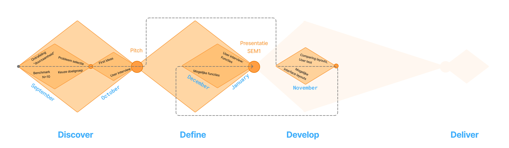

## Methodologie

Als methodologie wordt een aangepaste versie van het "dubble diamont" model gebruikt, namelijk het "tripple diamont model":

Beide ontwerpmodellen zijn gebaseerd op twee terugkerende principes: divergentie en convergentie. 

Bij divergentie worden opties gecreëerd.

Bij convergentie worden er keuzes gemaakt tussen deze opties.

Elke fase van het model bestaat uit deze twee principes, maar divergentie-convergentie wordt ook op kleinere schaal toegepast. Dit wordt voorgesteld door de kleinere ruiten in de grotere ruiten, die de fasen voorstellen.

Het "triple diamond"-model bestaat uit meerdere fasen, die hieronder kort worden uitgelegd:

### Discover
Deze fase speelt zich af in de probleemruimte. De bedoeling is volop op zoek te gaan naar problemen en opportuniteiten.

In deze fase werd eerst onderzoek gedaan naar een probleem; vervolgens werd onderzocht of dit een goede opportuniteit was.

Deze fase wordt ook in detail besproken in [Discovery](discovery.md)

### Define
De define-fase speelt zich af in de oplossingsruimte Hier is de bedoeling om oplossingen te zoeken voor het probleem dat uit de discover-fase is gekomen.

Bij deze fase bleek het een uitdaging te zijn om ons op het juiste pad te houden en niet de mist in te wandelen...

Er werd eerst onderzoek gedaan naar de meest intuïtieve layout van een scherminterface Dit onderzoek had bij nader inzien beter gepast bij de develop-fase.

Na dit onderzoek werd beseft dat we niet eens wisten aan welke functies dat "intuïtieve interface" moest voldoen. Het volgende onderzoek was dus in verband met de functies van het apparaat.

Deze fase wordt in meer detail besproken in [Definition](definition.md)

### Develop
*Coming soon* ;)
#TODO

### Deliver
*Coming soon* ;)
#TODO

 

---

  <a href="/Methodologie.md">⬆️ Return to top</a> 
  <a href="/README.md">🏠 Return to main<a> 
  <a href="/LICENSE">📜 CC License</a> & <a href="/LICENSE">MIT License</a> 

