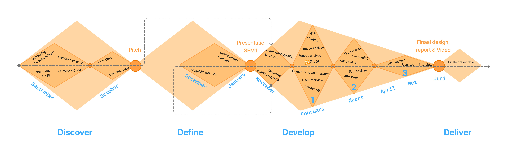

## Methodologie

Als methodologie wordt een aangepaste versie van het "dubble diamont" model gebruikt, namelijk het "tripple diamont model":

Beide ontwerpmodellen zijn gebaseerd op twee terugkerende principes: divergentie en convergentie. 

Bij divergentie worden opties gecreëerd.

Bij convergentie worden er keuzes gemaakt tussen deze opties.

Elke fase van het model bestaat uit deze twee principes, maar divergentie-convergentie wordt ook op kleinere schaal toegepast. Dit wordt voorgesteld door de kleinere ruiten in de grotere ruiten, die de fasen voorstellen.

Het "triple diamond"-model bestaat uit meerdere fasen, die hieronder kort worden uitgelegd:

### Discover
Deze fase speelt zich af in de probleemruimte. De bedoeling is volop op zoek te gaan naar problemen en opportuniteiten.

In deze fase werd eerst onderzoek gedaan naar een probleem; vervolgens werd onderzocht of dit een goede opportuniteit was.

Deze fase wordt ook in detail besproken in [Discovery](1_Discovery.md)

### Define
De define-fase speelt zich af in de oplossingsruimte Hier is de bedoeling om oplossingen te zoeken voor het probleem dat uit de discover-fase is gekomen.

Bij deze fase bleek het een uitdaging te zijn om ons op het juiste pad te houden en niet de mist in te wandelen...

Er werd eerst onderzoek gedaan naar de meest intuïtieve layout van een scherminterface Dit onderzoek had bij nader inzien beter gepast bij de develop-fase.

Na dit onderzoek werd beseft dat we niet eens wisten aan welke functies dat "intuïtieve interface" moest voldoen. Het volgende onderzoek was dus in verband met de functies van het apparaat.

Deze fase wordt in meer detail besproken in [Definition](2_Definition.md)

### Develop
De develop-fase bouwt verder op de inzichten uit de define-fase en focust op het concreet uitwerken en testen van oplossingen. Deze fase wordt opgedeeld in drie stappen: Develop 1, Develop 2 en Develop 3.

In **Develop 1** werd inzicht verworven in de gebruikers en de technische werking. Via user interviews en fysieke tests werd bepaald welke actuatoren geschikt zijn en welke eisen gebruikers stellen aan het product, zoals betrouwbaarheid, gebruiksgemak en snelle setup.

Deze fase wordt in meer detail besproken in [Develop 1](3_Develop_1.md)

In **Develop 2** werden verschillende deeloplossingen verder uitgewerkt en vergeleken. Door middel van prototyping, keuzematrices en gebruikerstesten werd er een selectie gemaakt voor de beste mechanismen, zoals de sliding + rotating arm, geschikte actuatoren en bevestigingsmethodes. 

Deze fase wordt in meer detail besproken in [Develop 2](4_Develop_2.md)

In **Develop 3** lag de focus op vormgeving, materiaalkeuze en gebruikerservaring (CMF + UX). Verschillende varianten werden ontwikkeld en getest om te bepalen welke het meeste vertrouwen, duurzaamheid en gebruiksvriendelijkheid uitstralen. 

Deze fase wordt in meer detail besproken in [Develop 3](5_Develop_3.md)

Doorheen deze fase werd continu gedivergeerd en geconvergeerd, waarbij ideeën werden gegenereerd, getest en vervolgens gefilterd tot een onderbouwde ontwerpkeuze.

### Deliver

Het doel van het Minimum Viable Product (MVP) was om de meest essentiële interacties van het concept te demonstreren en te valideren.

Voor het [MVP](../docs/MVP.md) werden volgende vereisten opgesteld:

- Meerdere knoppen moeten kunnen worden ingedrukt.
- Minstens één draaiknop moet kunnen worden bediend.
- Het apparaat moet stevig bevestigd kunnen worden op een wasmachine.

Tijdens de ontwikkeling zijn de eerste en derde vereiste succesvol gerealiseerd. Het prototype kan meerdere knoppen bedienen en kan op een wasmachine worden bevestigd zoals voorzien.

De bediening van een draaiknop kon echter niet volledig worden geïmplementeerd binnen de beschikbare projecttijd. Hoewel hiervoor concepten en technische oplossingen werden onderzocht, werd deze functionaliteit niet opgenomen in het finale prototype. Dit vormt een belangrijk aandachtspunt voor toekomstige iteraties van het ontwerp.

Ondanks deze beperking slaagt het MVP erin de kern van het concept aan te tonen en de belangrijkste interacties te valideren. Het prototype levert waardevolle inzichten op voor een verdere ontwikkeling richting een volledig functioneel product.

 

---

  <a href="/Methodologie.md">⬆️ Return to top</a> 
  <a href="/README.md">🏠 Return to main<a> 
  <a href="/LICENSE">📜 CC License</a> & <a href="/LICENSE">MIT License</a> 

