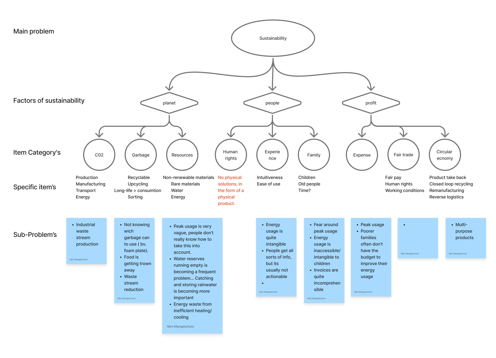
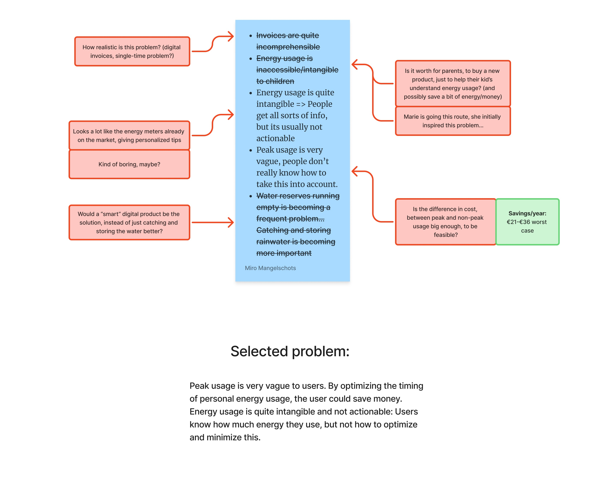
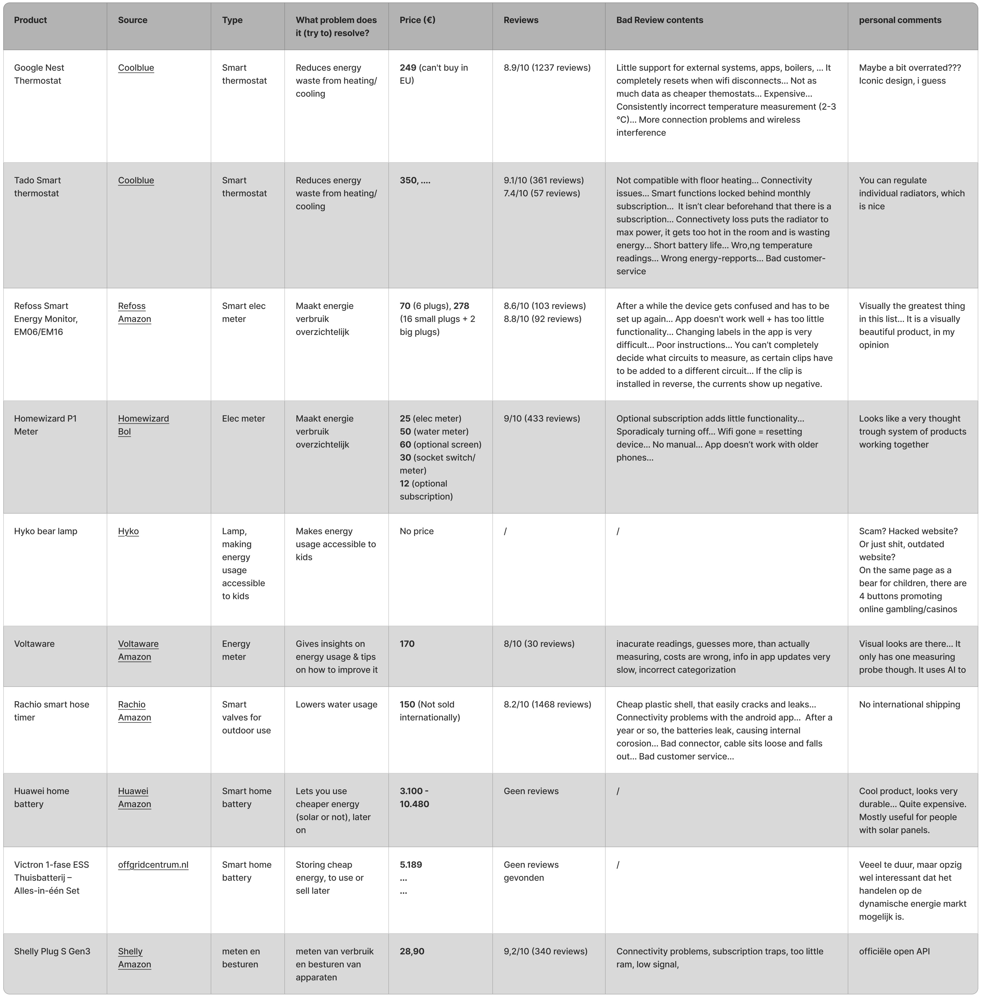

## Discovery
**Max. 1000 woorden.   
[!] Algmeen: Maak voldoende gebruik van schematische/grafische weergaves en tabellen.**

### Doelstellingen
**Wat wilde je bereiken?   
Welke deelvragen moesten hiervoor beantwoord worden?**

Het doel van deze fase in het ontwerpproces is om een eerste oriëntatie van de probleemruimte te voltooien en te onderzoeken voor welke onderverdelingen van duurzaamheid, in de thuiscontext, er al oplossingen bestaan. Het doel is om daarna een probleem te kiezen en uit te zoeken, of dit een reeël probleem is. Het is ook de bedoeling om een eerste onderzoek te doen, naar de wensen en noden van gebruikers.

### Materiaal & methoden
**Hoe onderzocht je dit? Wees volledig.    
Leg uit welke onderzoeksmethoden werden uitgevoerd en hoe dit werd aangepakt (link door naar het protocol).**

Het is een uitdaging om vanuit een brede term, zoals "duurzaamheid in huis", terecht te komen bij een specifiek probleem. Om deze stap makkelijker en meer gestructureerd te laten verlopen, werd eerst de term "duurzaamheid" ontleed in de drie domeinen van duuzaamheid (3P) namelijk: "People", "Planet", "Profit". Vervolgens werden deze domeinen onleed in categoriën, die op hun beurt werden opgesplits in specifieke onderwerpen. Voor elk van deze onderwerpen werden problemen bedacht, om tot een hele lijst problemen, binnen het thema te komen.

  

Om te helpen bij het opstellen van deze probleem-lijst, werd parallel een benchmark opgesteld, die ook van grote hulp was bij het kiezen van een finaal probleem. Deze benchmark werd afgelegd aan de hand van online beschikbare informatie. Voor meer informatie omtrent de benchmark zie <a href="../docs/S@H_Benchmark protocol.pdf">Benchmark protocol</a>.

**Resultaten Benchmark bij resultaten i gues????**

Uit deze lijst met problemen werden de meest aantrekkelijke exemplaren geselecteerd. Op de problemen in deze selectie, werd wat dieper nagedacht, waarna deze tegenover elkaar werden vergeleken. Ook werd rekening gehouden met de benchmark. Vervolgens werd op wijze van eliminatie, een finale uitdaging gekozen.

  

Het geselcteerde probleem was: Door varierende energieprijzen, betalen gebruikers meer voor hun energie, dan nodig is. **.........????**

### Resultaten
**Rapporteer over de resultaten (incl. foto's, quotes, analyseframeworks, ...)**

  

### Conclusies & implicaties
**Definieer de belangrijkste designbeslissingen**
