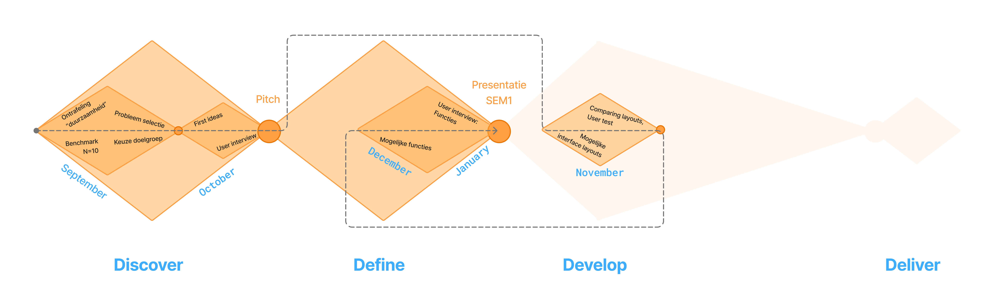

## Methodologie
**Max 400 woorden. Beschrijf je methodologie (enkel SEM1, zie les methodologie). Maak hierbij gebruik van een afbeelding om je tijdlijn weer te geven. Op deze tijdlijn moeten minimaal (1) een tijdsincatie te zien zijn (e.g. maanden of kwartalen), moeten fasen te zien (gekoppeld aan doelstellingen van die fase) zijn en moeten activiteiten te zien zijn (onderzoeksmethoden). Bekijk zeker ook eens [voorbeelden van eerdere jaren](https://github.com/basbaccarne/human-centered-design) (voor SEM1 betreft dit uiteraard slechts de helft van deze visualisaties). We boewen hier in het tweede semester op verder.   
Neem hier ook een tijdlijn in op waarin we de evoluties van de prototypes kunnen zien.**

Als methodologie wordt een aangepaste versie van het "dubble diamont" model gebruikt, namelijk het "tripple diamont model":

Beide ontwerpmodellen zijn gebasseert op twee werkerende principes: divergentie en convergentie. 
Bij divergentie worden opties gecreërd
Bij convergentie worden er keuzes gemaakt tussen deze opties.
Elke fase van het model bestaat uit deze twee principes, maar divergentie-convergentie, wordt ook op kleinere schaal toegepast, dit wordt voorgesteld door de kleinere ruiten in de grotere ruiten, die de fasen voorstellen.
Het "tripple diamont" model bestaat uit meerdere fasen, die hieronder kort worden uitgelegd:

### Discover
Deze fase speelt zich af in de probleemruimte. De bedoeling is vollop opzoek te gaan naar problemen en opportuniteiten.

In deze fase werd eerst onderzoek gedaan naar een probleem, vervolgens werd onderzocht of dit een goede opportuniteit was.

### Define
De define fase speelt zich af in de oplossingenruimte. Hier is de bedoeling om oplossingen te zoeken voor het probleem dat uit de discover fase is gekomen.

Er werdt eerst 

### Develop

### Deliver