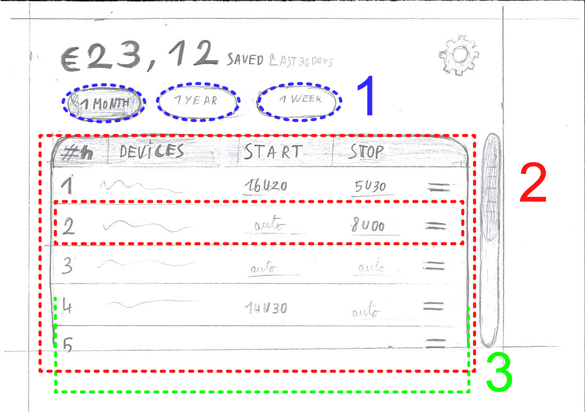

## Opstellen interfaces
De theorie achter het opstellen van de interfaces, voor het interface onderzoek, wordt hier kort besproken. <a href="../reports and protocols/Interface protocol.pdf">Interface protocol</a> gaat dieper in op dit onderzoek. De resultaten worden besproken in <a href="../reports and protocols/Inteface report.pdf">Interface report</a>.

Bij het opstellen van de interfaces werd gebruik gemaakt van de "Gestalt wetten". Hieronder wordt per interface toegelicht, hoe de "Gestalt wetten" gebruikt werden.

> [!WARNING]
>test

### Interface 1

De grote knoppen, aan de onderkant van het scherm maken gebruik van **Similarity**, waardoor de onderkant van het scherm als een aparte zone gezien zou kunnen worden. Ook "year", "month" en "Week" -knoppen maken gebruik van similarity.

**law of common region** werdt gebruikt om de knoppen "year", "month" en "Week" af te zonderen van de rest van het scherm.

Op pagina 2 & 3 van dit interface werd **law of common region** gebruikt, om informatie te groeperen per apparaat (zoals naam en limieten).

### Interface 2

Bij interface 2 is gebasseerd op **Fitt’s law** en **Hick's law**, om het interface zo simpel mogelijk te maken. 

> ***Fitt's law***
"The time to acquire a target is a function of the distance to and size of the target."

=> Eén menu, zonder submenu's of verborgen opties, zorgt voor een snellere en intuïtievere navigatie.

> ***Hick’s law***
"The time it takes to make a decision increases with the number and complexity of
choices."

=> Een klein aantal knoppen en mogelijke interacties, zorgt voor een snellere en intuïtievere navigatie.

Verder werdt **law of common region** gebruikt om alle instellingen te groeperen en af te zonderen van het verbruik.
Ook om deze instellingen te groeperen per apparaat werd law of common region gebruikt.

Het principe van **similarity** werd toegepast op de "1 year", "1 month" en "1 Week" -knoppen.

**Continuation** werd gebruikt om duidelijk te maken dat het interface verder loopt dan de gebruiker kan zien. Er kan dus nog naar beneden genavigeerd worden... Dit werdt al volgt toegepast:
-  De kader rond de instellingen wordtr afgesneden door de onderkant van het scherm
- het onderste apparaat wordt doormidden gesneden door de onderkant van het scherm.

### Interface 3

Opnieuw werdt het principe van **similarity** toegepast op de "day"", "week", "month" en "year" -knoppen.
Om deze knoppen af te zonderen en duidelijk te maken welke knop geselecteerd is, werdt **law of common region** gebruikt.

### Interface 4

Knoppen die niet ingedrukt of "actief" zijn worden weergegeven met een 3D-effect, waardoor ze lijken uit te steken. Als een knop ingedrukt is, dan lijkt deze lager te liggen dan de andere knoppen. Dit is het gebruik van **common fate**.

**Proximity** werd gebruikt om knoppen te groeperen. De "D", "W, "M" en "J" -knoppen liggen bijvoorbeeld dicht bijeen, waardoor ze intuitief gegroepeerd worden.

